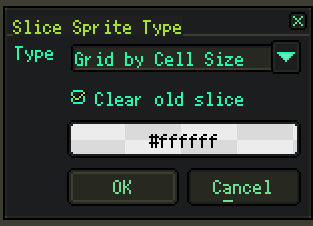
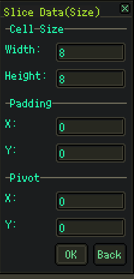

# My Aseprite Script

My [Aseprite](https://github.com/aseprite/aseprite) script Lib.

## List

### Slice by

Sprite slice tool.

* slice by cell size
* slice by cell count

## License

[MIT](./LICENSE)